<div align="center">

# ⚡ DevOps Linux Toolbox

### 🚀 Production-ready scripts, templates, and automation labs for Linux, Docker, Kubernetes, CI/CD, GitOps, Monitoring, Security, Backup, Cloud, and Homelab Engineering.

<br/>


<br/>

> **From fresh Linux server → secured system → containers → Kubernetes → GitOps → monitoring → backups → disaster recovery.**

</div>

---

## 🧠 What is this repository?

`devops-linux-toolbox` is a complete hands-on DevOps engineering repository containing scripts and templates for real-world infrastructure work.

It is designed for:

| Area | Purpose |
|---|---|
| 🐧 Linux | Server health, users, logs, firewall, services |
| 🐳 Docker | Install, cleanup, backup, restore, health checks |
| ☸️ Kubernetes | Deployments, rollback, debugging, secrets, PVC backup |
| ⛵ Helm | Install, upgrade, backup, and manage platform charts |
| 🚀 Argo CD | GitOps setup, sync, export, disaster recovery |
| 📊 Monitoring | Prometheus, Grafana, node-exporter, status pages |
| 🔐 Security | Linux hardening, SSH audit, Docker/K8s security checks |
| 💾 Backup | Full server, DB, Docker volume, S3/rclone backup |
| ☁️ Cloud | AWS CLI, EC2, S3, ECR, free-tier cost guard |
| 🧱 Terraform | AWS, Docker, Kubernetes, GitHub infrastructure templates |
| 🤖 Ansible | Linux automation, Docker, Nginx, PostgreSQL, K3s |
| 🏠 Homelab | K3s, Argo CD, Grafana, Prometheus, Jenkins automation |
| 🧪 Labs | Troubleshooting and interview practice projects |

---

## 🏗️ Repository Architecture

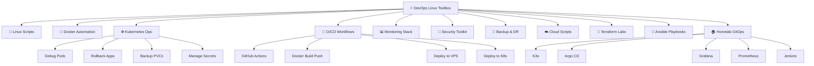

---

## 📦 Folder Structure

```text
devops-linux-toolbox/
├── scripts/
│   ├── linux/              # Linux admin scripts
│   ├── sysadmin/           # Daily server operations
│   ├── docker/             # Docker install, cleanup, backup
│   ├── kubernetes/         # K8s deployment/debug/backup tools
│   ├── helm/               # Helm install/upgrade helpers
│   ├── argocd/             # GitOps automation
│   ├── monitoring/         # Prometheus/Grafana utilities
│   ├── logging/            # Log scanners and analyzers
│   ├── database/           # PostgreSQL/MySQL/Redis scripts
│   ├── security/           # Hardening and audit tools
│   ├── backup/             # Backup and restore automation
│   ├── cloud/              # AWS helper scripts
│   ├── terraform/          # Terraform wrapper scripts
│   ├── homelab/            # Homelab platform automation
│   └── pro/                # Advanced deployment utilities
├── docker-compose/         # Production-style Compose templates
├── github-actions/         # Reusable CI/CD workflows
├── .github/workflows/      # Ready GitHub Actions workflows
├── terraform/              # IaC labs and examples
├── ansible/                # Server automation playbooks
├── k8s/                    # Kubernetes sample manifests
├── homelab-gitops-platform/# K3s + Argo CD + monitoring + Jenkins
├── ultra-pro-projects/     # Advanced portfolio project ideas
├── MANIFEST.md             # Full script list
├── setup.sh                # Make scripts executable
└── README.md
```

---

## 🚀 Quick Start

```bash
git clone https://github.com/YOUR_USERNAME/devops-linux-toolbox.git
cd devops-linux-toolbox
chmod +x setup.sh
./setup.sh
```

Run your first Linux health script:

```bash
./scripts/linux/01-system-info.sh
```

Run a dry-run safe script:

```bash
./scripts/docker/32-docker-cleanup.sh --dry-run
```

---

## 🧭 DevOps Workflow

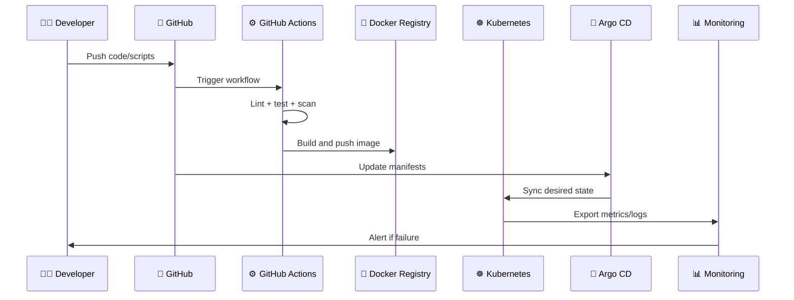

---

## 🧰 Script Categories

### 🐧 Linux Essentials

| Script | Description |
|---|---|
| `01-system-info.sh` | Full system information |
| `02-disk-usage-alert.sh` | Disk usage alert |
| `03-memory-check.sh` | Memory usage report |
| `04-cpu-top-processes.sh` | Top CPU processes |
| `05-service-status.sh` | Check systemd services |
| `10-basic-firewall-setup.sh` | UFW firewall baseline |
| `11-update-linux-server.sh` | Update and clean server |

---

### 🐳 Docker Operations

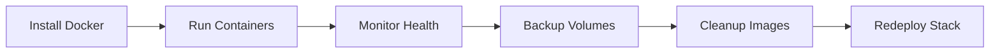

| Script | Description |
|---|---|
| `31-docker-install-ubuntu.sh` | Install Docker on Ubuntu |
| `32-docker-cleanup.sh` | Clean unused Docker resources |
| `33-docker-container-health.sh` | Show unhealthy containers |
| `36-docker-backup-volumes.sh` | Backup Docker volumes |
| `38-docker-compose-updated-redeploy.sh` | Pull and redeploy Compose stack |

---

### ☸️ Kubernetes Operations

| Script | Description |
|---|---|
| `73-kubectl-context-switcher.sh` | Switch K8s context |
| `75-k8s-app-deploy.sh` | Deploy manifests |
| `76-k8s-rollout-status.sh` | Check rollout status |
| `77-k8s-rollback-deployment.sh` | Roll back deployment |
| `78-k8s-pod-debug.sh` | Debug pods |
| `79-k8s-node-health.sh` | Node health report |
| `82-k8s-secret-create-env.sh` | Create secret from `.env` |
| `87-k8s-backup-manifests.sh` | Export manifests |

---

## 🏠 Homelab Platform

This repo includes a homelab automation skeleton for:

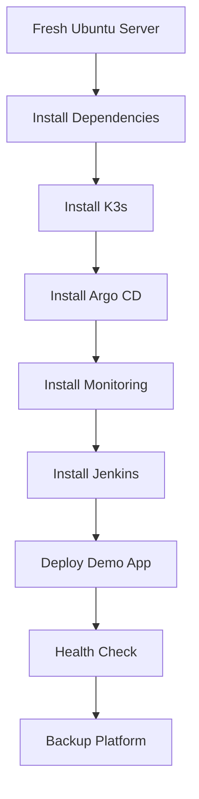

### Default Homelab Stack

| Tool | Purpose |
|---|---|
| K3s | Lightweight Kubernetes |
| Argo CD | GitOps deployment |
| Prometheus | Metrics collection |
| Grafana | Dashboards |
| Jenkins | CI/CD server |
| PostgreSQL | App database |
| Docker | Container runtime/dev tool |

---

## 📊 Monitoring Architecture

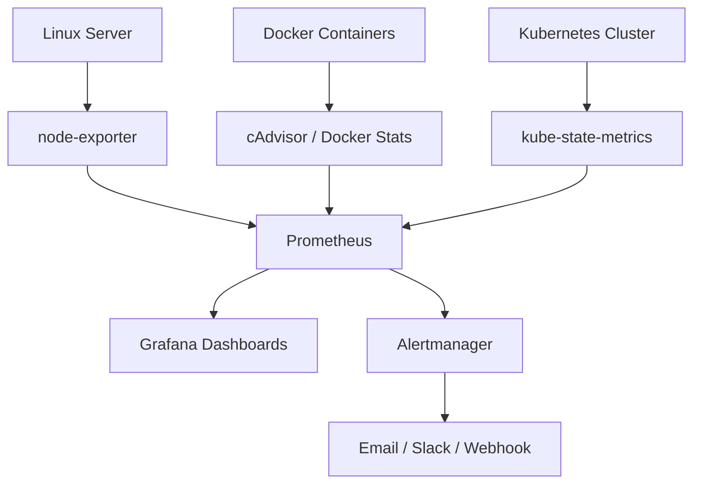

---

## 🔐 Security Model

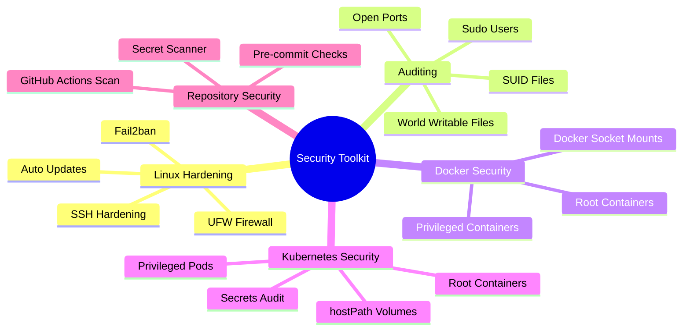

---

## 💾 Backup & Disaster Recovery

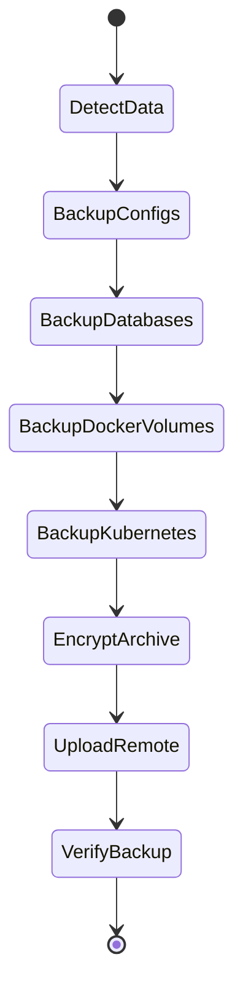

| Backup Type | Included |
|---|---|
| Linux configs | `/etc`, systemd units, app configs |
| Docker | Volumes, Compose files |
| PostgreSQL | SQL dumps |
| Kubernetes | YAML exports, secrets, PVC data |
| Remote | S3/rclone-ready scripts |
| Restore | Server and homelab restore templates |

---

## 🚀 CI/CD Pipeline

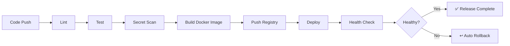

---

## 🧱 Terraform Labs

| Lab | Description |
|---|---|
| `161-terraform-aws-ec2` | EC2 instance with security group |
| `162-terraform-aws-s3-backup` | S3 backup bucket |
| `163-terraform-vpc-basic` | VPC and subnet |
| `164-terraform-docker-local` | Local Docker with Terraform |
| `165-terraform-k8s-namespace` | Kubernetes namespace |
| `166-terraform-github-repo` | GitHub repository automation |
| `167-terraform-modules` | Reusable module area |

---

## 🤖 Ansible Playbooks

| Playbook | Purpose |
|---|---|
| `169-ansible-install-docker.yml` | Install Docker |
| `170-ansible-install-nginx.yml` | Install Nginx |
| `171-ansible-create-users.yml` | Create users |
| `172-ansible-linux-hardening.yml` | Harden Linux |
| `173-ansible-postgres-setup.yml` | Install PostgreSQL |
| `176-ansible-k3s-install.yml` | Install K3s |
| `177-ansible-homelab-bootstrap.yml` | Bootstrap homelab |

---

## 🧪 Ultra Pro Portfolio Projects

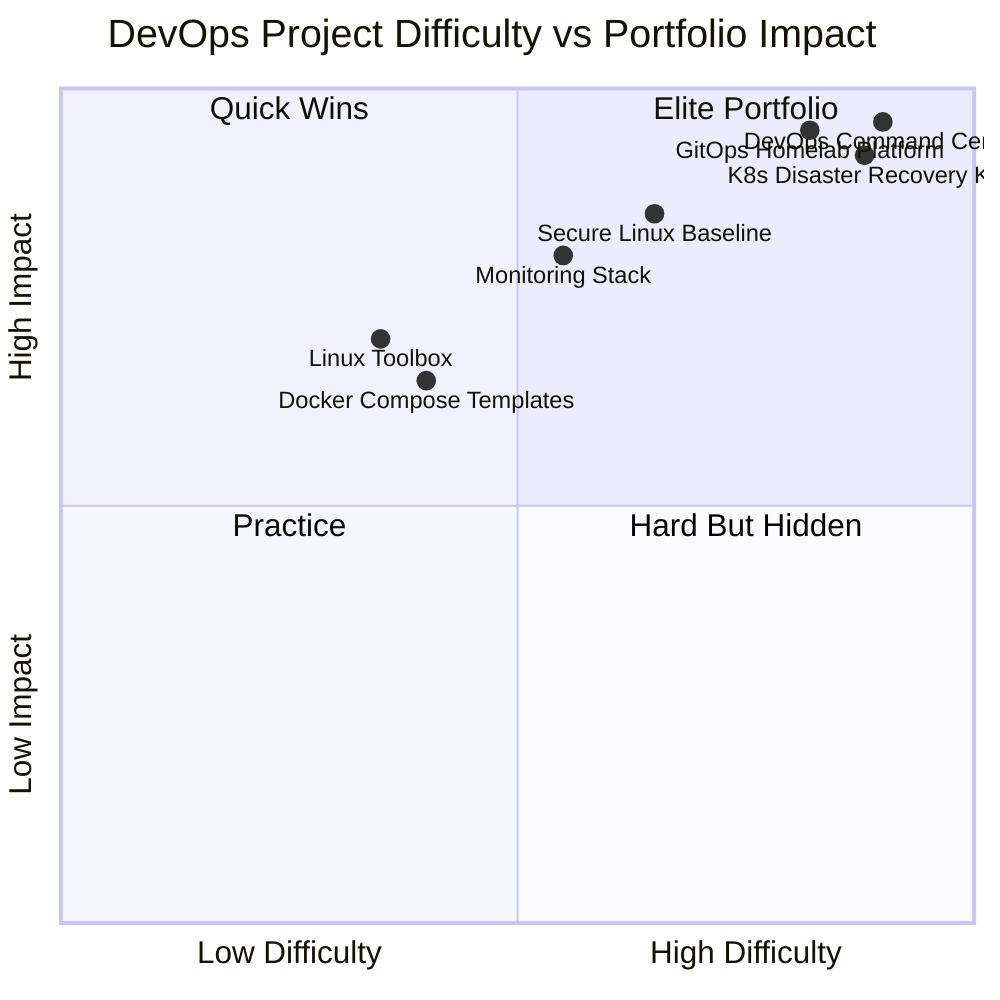

| Project | Why it is valuable |
|---|---|
| `self-healing-server-agent` | Shows automation and troubleshooting |
| `gitops-homelab-platform` | Shows real platform engineering |
| `devops-command-center` | Shows dashboard + backend + ops skills |
| `k8s-disaster-recovery-kit` | Shows serious Kubernetes knowledge |
| `cloud-cost-guardian` | Shows AWS cost-control awareness |
| `secure-linux-baseline` | Shows security mindset |
| `ci-cd-template-factory` | Shows reusable pipeline design |
| `observability-stack-template` | Shows monitoring/logging experience |
| `production-readiness-checker` | Shows real production thinking |
| `troubleshooting-labs` | Shows teaching/interview readiness |

---

## 🧑‍💻 Recommended Usage Path

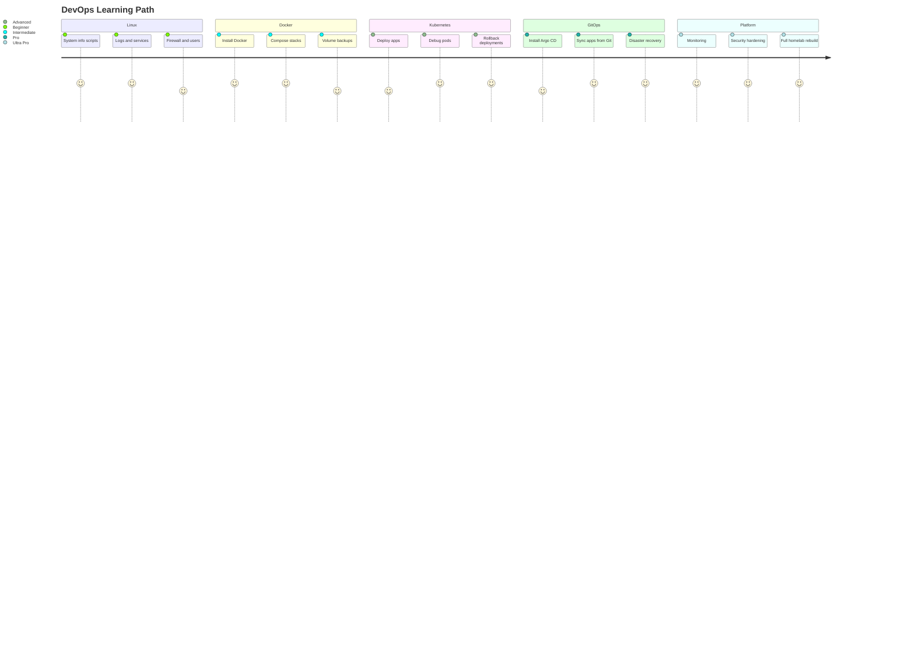

---

## 🛡️ Safety Rules

Before running any script:

```bash
./script-name.sh --help
./script-name.sh --dry-run
```

Recommended rules:

- ✅ Read the script before running it.
- ✅ Use `--dry-run` where available.
- ✅ Never commit `.env` files.
- ✅ Never commit real cloud keys.
- ✅ Test on a local VM before production.
- ✅ Backup before destructive operations.
- ✅ Use least privilege access.

---

## 📌 Example Commands

### Make all scripts executable

```bash
chmod +x setup.sh
./setup.sh
```

### Check Linux server health

```bash
./scripts/linux/01-system-info.sh
./scripts/linux/02-disk-usage-alert.sh
./scripts/linux/03-memory-check.sh
```

### Check Docker health

```bash
./scripts/docker/33-docker-container-health.sh
```

### Debug Kubernetes pod

```bash
./scripts/kubernetes/78-k8s-pod-debug.sh default my-pod-name
```

### Backup PostgreSQL

```bash
DB_NAME=mydb DB_USER=postgres ./scripts/database/125-postgres-backup.sh
```

---

## 🌟 Portfolio Message

This repository proves that I can:

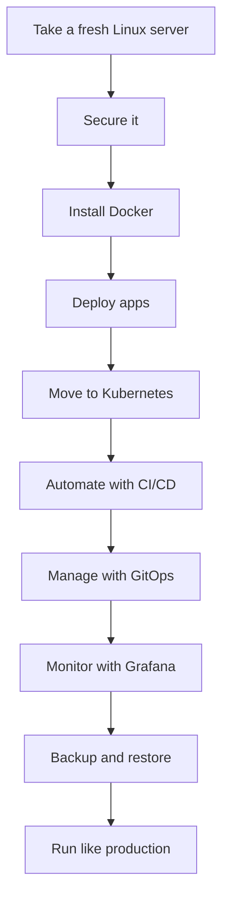

> **Goal:** become the kind of DevOps engineer who can build, deploy, monitor, secure, and recover real systems.

---

## 🤝 Contributing

Contributions are welcome.

Good contributions:

- Add safer error handling
- Add `--dry-run` support
- Improve README examples
- Add tests
- Add real-world troubleshooting labs
- Add production-ready Docker/Kubernetes templates

---

## 📜 License

MIT License.

---

<div align="center">

## ⭐ Star this repo if it helps you learn DevOps

### Built with ❤️ for Linux, DevOps, Kubernetes, GitOps, and Homelab Engineering.

</div>
